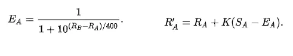

# OOP-LAB12
## SETUP
1. Move this folder(oop-lab12) into oop-python-nycu.
2. Follow the command below.
```
cd ~/oop-python-nycu
source Docker/cpu/docker_run.sh
source colab_jupyter.sh
```
3. Then click ther site; passwrd is "assistive".
4. Start edit the file"oop-python-nycu/oop-lab12/oop_lab12.ipynb"

## ELO equation


```
EA: Expected score for Player A. This represents the probability that Player A will win against Player B.
RA: Current rating of Player A.
RB: Current rating of Player B.

RA′: New rating for Player A after the match.
RA:  Current rating of Player A before the match.
K:   K-factor, a constant that determines the maximum possible adjustment per game. Higher values of K result in more significant changes in ratings.
SA:  Actual score for Player A in the match. This can be 1 for a win, 0.5 for a draw, and 0 for a loss.
EA:  Expected score for Player A, as calculated in the first equation.
```

## LABs
See the description in the code (oop_lab12.ipynb).